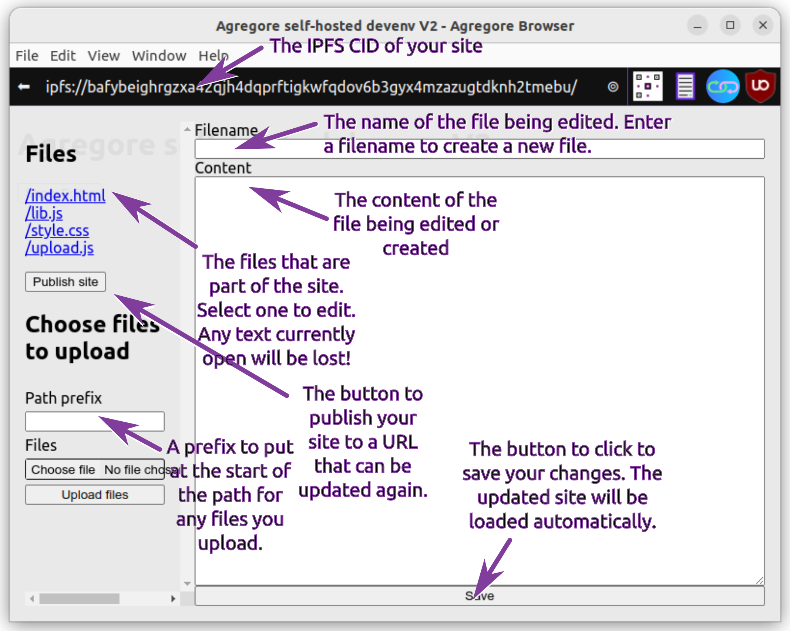
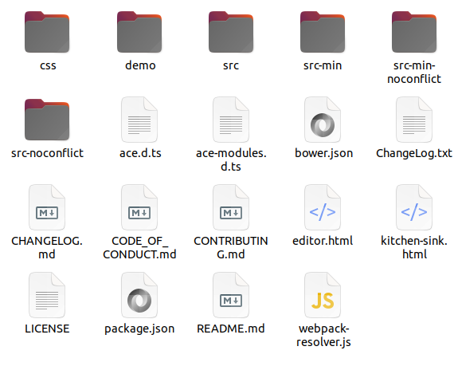
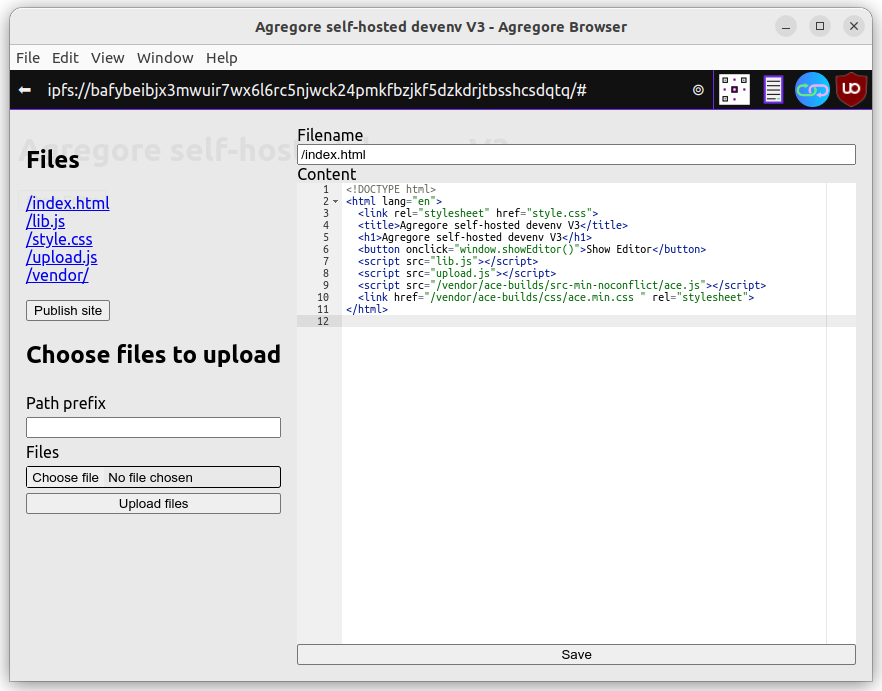

# Tutorial

In this tutorial we will be adding a 3rd party dependency to an app hosted on IPFS. The specific 3rd party dependency we'll be adding is the [ACE editor](https://ace.c9.io/) and we will use it to improve editing of JavaScript, HTML and CSS code in the development environment we've previously built.

In the Agregore browser, open the [development environment bootstrap app](/docs/examples/browser-devenv-v2/) and click on the "start" button. Once your site has been created, you can click on the "edit" button to open up the editor.



# Adding ACE as a dependency

We can get going quickly by using ACE hosted by [jsDelivr](https://www.jsdelivr.com/package/npm/ace-builds). Open up `index.html` and add:

```html
<!DOCTYPE html>
<html lang="en">
  <link rel="stylesheet" href="style.css">
  <title>Agregore self-hosted devenv V2</title>
  <h1>Agregore self-hosted devenv V2</h1>
  <button onclick="window.showEditor()">Show Editor</button>
  <script src="lib.js"></script>
  <script src="upload.js"></script>
<!-- + -->  <script src=" https://cdn.jsdelivr.net/npm/ace-builds@1.31.2/src-min-noconflict/ace.min.js "></script>
<!-- + -->  <link href=" https://cdn.jsdelivr.net/npm/ace-builds@1.31.2/css/ace.min.css " rel="stylesheet">
</html>
```

To use the editor we will update the code where we create the editor, load content into the editor and get the content from the editor to save a file. We need to make all these updates at the same time to avoid being stuck with a non-functional editor.

The following two functions in `lib.js` need to be updated: `showEditor()` and `loadFile()`.


```js
async function loadFile(filename){
    const resp = await fetch(filename)
    const content = await resp.text()
    document.getElementById('idFilenameInput').value = filename
//- document.getElementById('idContentInput').value = content
    window.editor.setValue(content)                                          //+
    if (filename.match(/\.js/)){                                             //+
        editor.session.setMode("ace/mode/javascript")                        //+
    } else if (filename.match(/\.html/)){                                    //+
        editor.session.setMode("ace/mode/html")                              //+
    } else if (filename.match(/\.css/)){                                     //+
        editor.session.setMode("ace/mode/css")                               //+
    } else {                                                                 //+
        editor.session.setMode("ace/mode/text")                              //+
    }                                                                        //+
}
```

```js
async function showEditor(){
    let editorDiv = document.getElementById("editor")
    if (!editorDiv){
        editorDiv = document.createElement('div')
        editorDiv.id = 'editor'
    }
    editorDiv.style = `display: flex;
        position: absolute;
        top: 0;
        left: 0;
        width: 100vw;
        height: 100vh;
        background-color: rgb(233 233 233 / 95%);
    `
    const editorStyle = document.createElement('style')                      //+
    editorStyle.innerHTML = "#idForm pre { flex-grow: 1; margin: 0; }"       //+
    document.body.appendChild(editorStyle)                                   //+

    editorDiv.innerHTML = `<div style="display: flex; flex-grow: 1; padding: 1em">
        <div id="idSidebar" style="padding-right: 1em; min-width: 20vw;"><h2>Files</h2>
        </div>
        <form id="idForm" style="flex-grow: 1; display: flex; flex-direction: column;" spellcheck="false">
            <label for="idFilenameInput">Filename</label>
            <input type="text" name="filename" id="idFilenameInput"></input>
            <label for="idContentInput">Content</label>
            <textarea id="idContentInput"></textarea>
            <input type="submit" value="Save"></input>
        </form>
    </div>`
    document.body.appendChild(editorDiv)

    window.editor = ace.edit("idContentInput")                               //+

    const form = document.getElementById('idForm')
    form.onsubmit = e => {
        e.preventDefault()
        const filename = document.getElementById('idFilenameInput').value
//-     const content = document.getElementById('idContentInput').value
        const content = window.editor.getValue()                             //+
        updateSite(filename, content)
    }

    await loadSidebar()
}
```

Let's look through what we've updated, marked in the code above with `//-` at the start of lines we removed and `//+` at the end of lines we added. We'll take this in logical order. 

In ```showEditor``` we are initializing the ACE editor using the API described on their [site](https://ace.c9.io/).

```js
window.editor = ace.edit("idContentInput")
```

To properly size te editor, we add some styles as an inline `<style></style>` element:

```js
const editorStyle = document.createElement('style')
editorStyle.innerHTML = "#idForm pre { flex-grow: 1; margin: 0; }"
document.body.appendChild(editorStyle)
```

Then, to load the content of a file and set the correct highlighting mode, we updated `loadFile`:

```js
    window.editor.setValue(content)
    if (filename.match(/\.js/)){                                             //+
        editor.session.setMode("ace/mode/javascript")                        //+
    } else if (filename.match(/\.html/)){                                    //+
        editor.session.setMode("ace/mode/html")                              //+
    } else if (filename.match(/\.css/)){                                     //+
        editor.session.setMode("ace/mode/css")                               //+
    } else {                                                                 //+
        editor.session.setMode("ace/mode/text")                              //+
    }                                                                        //+
```

And finally, we had to update the way we get the code from the editor in the `onSubmit` callback:

```js
const content = window.editor.getValue()
```

By utilizing a third-party library (ACE), we only needed to make a few minor changes to improve the code editor significantly!

## Hosting the dependency on IPFS

The code for the ACE library is loaded using HTTP(S). This works as long as you have connectivity to the internet, but we want to make the development environment be self-contained. Previously we've added to ability to upload a whole folder using the development environment and we are now going to use this feature to upload all the required files for ACE.

You can find the required files on the [ace-builds GitHub page](https://github.com/ajaxorg/ace-builds/releases). Download the latest version and extract it somewhere on your computer.



Go back to the editor. In the sidebar, enter `/vendor/ace-builds/` in the **"Path prefix"** and then select the "src-min-noconflict" directory to upload.
Once the upload has completed the page will reload. Open the editor, enter `/vendor/ace-builds/` in the **"Path prefix"** again and this time upload the css directory inside `ace-builds`.

You will see that all the uploaded files breaks the sidebar, we'll fix that shortly. But first lets use the files we've just added!. Open `index.html` and update the paths for the ACE javascript and CSS:

```html
  <script src="/vendor/ace-builds/src-min-noconflict/ace.js"></script>
  <link href="/vendor/ace-builds/css/ace.css " rel="stylesheet">
```

Now that this is done, let's fix the sidebar by adding special handling for `/vendor/` in `loadSidebar`. 

```js
async function loadSidebar(){
    const sidebar = document.getElementById('idSidebar')
    const files = await listDir(window.origin)
    const list = document.createElement('ul')
    list.style =  "list-style: none; padding-inline-start: 0;"

    async function makeFileListElements(path, file) {
        if (path == '/' && file == 'vendor/') {                              //+
            let li = document.createElement('li')                            //+
            li.innerHTML = `<a href="/vendor/">/vendor/</a>`                 //+
            return [li]                                                      //+
        }                                                                    //+
        if (file.endsWith('/')){
            let subfiles = await listDir(window.origin + path + file)
            let elements = await Promise.all(
                subfiles.map(subfile => 
                    makeFileListElements(path + file, subfile)
                )
            )
            return elements.reduce( (arr, el) => [...arr, ...el] )
        }
```        

Instead of traversing the directory and adding all the containing files, we are now adding a single link to view the contents of the directory.



And that's it! You can find the final code [on GitHub](https://github.com/AgregoreWeb/website/tree/main/docs/examples/browser-devenv-v3/files/). There is also an updated [self-hosted development environment](/docs/examples/browser-devenv-v3/) you can use!
