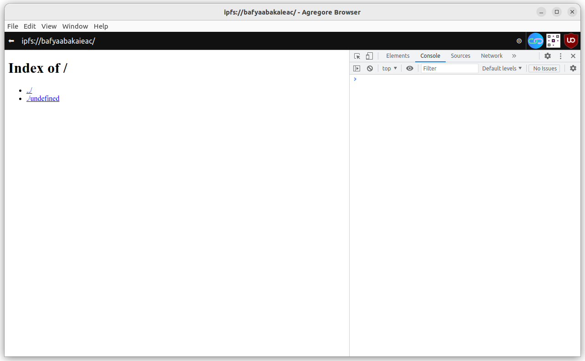

# Agregore Browser IPFS Development Environment

In this tutorial we are going to create a basic development environment you can use by working exclusively in the Agregore Browser.

## Part 1

Before we get started, you need to download the Agregore Browser. You can download the latest release from [GitHub](https://github.com/AgregoreWeb/agregore-browser/). Follow the link under releases to find the latest version and the appropriate binary for your system. [Here](https://github.com/AgregoreWeb/agregore-browser/releases/tag/v1.10.1) is a link to the latest version at the time of writing.

Once you've downloaded Agregore Browser, open the Browser to get started.

We're starting with a clean slate so we can introduce things step for step. In the address bar, enter the following address: [ipfs://bafyaabakaieac/](ipfs://bafyaabakaieac/). This is the IPFS address of an empty directory. You should see a page showing the following:

> Index of /
> - ../
> - /undefined

Now open the developer tools. To do so you can use the application top menu, it's File -> Open Dev Tools, or you can use Ctrl+Shift+I (press and hold the Ctrl, Shift and I key). You should see a sidebar open up. Then go to the 'Console' by clicking on the 'Console' tab. Here you will be able to enter and run JavaScript commands. This is what you should see at this point:



Lets create a basic HTML file - Hello World. In the console, enter the following text:

```javascript
let newPageContent = `<html>
  <head><title>Page title</title></head>
  <body><h1>Hello world</h1></body>
</html>`
let cid = window.location.hostname
const resp = await fetch(`ipfs://${cid}/index.html`, {method: 'put', body: newPageContent})
const newLocation = resp.headers.get('location')
window.location = newLocation
```

Okay, now we have our very first website saved to IPFS! We achieved this my using the `fetch` function to do a PUT request to the current IPFS content ID (CID for short) as the base URL and the filename we wanted to create/update. Fetch returned the CID for the updated content in the location header.

This is possible because the Agregore Browser runs it's own IPFS node and implements the `fetch` function for IPFS protocols like `ipfs://` and `ipns://`. You can read more about this on the [Agregore website](https://agregore.mauve.moe/).

We can update the content of the site by doing the same. Let's turn that into a function that we can reuse!

```js
async function updateSite(newPageContent){
    let cid = window.location.hostname
    const resp = await fetch(`ipfs://${cid}/index.html`, {method: 'put', body: newPageContent})
    const newLocation = resp.headers.get('location')
    window.location = newLocation
}
let newPageContent = `<html>
  <head><title>Page title</title></head>
  <body><h1>Hello world</h1><p>And hello darkness, you're still a friend.</p></body>
</html>`
updateSite(newPageContent)
```

Now try it again
```js
let newPageContent = `<html>
  <head><title>Page title</title></head>
  <body><h1>Hello world</h1><p>And hello darkness, you're still a friend.</p></body>
</html>`
updateSite(newPageContent)
```

Mmm, that didn't work. The problem is that we loose the `updateSite` function when we load the new page. Let's save the function to a file that is part of our site:
```js
let jsContent = `async function updateSite(newPageContent){
    let cid = window.location.hostname
    const resp = await fetch(`ipfs://${cid}/index.html`, {method: 'put', body: newPageContent})
    const newLocation = resp.headers.get('location')
    window.location = newLocation
}`
let cid = window.location.hostname
const resp = await fetch(`ipfs://${cid}/lib.js`, {method: 'put', body: jsContent})
const newLocation = resp.headers.get('location')
window.location = newLocation
```

That didn't quite work. The problem is the first line:
```js
let jsContent = `async function updateSite(newPageContent){
    let cid = window.location.hostname
    const resp = await fetch(`ipfs://${cid}/index.html`, {method: 'put', body: newPageContent})
    const newLocation = resp.headers.get('location')
    window.location = newLocation
}`
```

We could fix this, but there is an easier way to get the text body of an function. Let's define the function and then get the body using `.toString`

```js
async function updateSite(newPageContent){
    let cid = window.location.hostname
    const resp = await fetch(`ipfs://${cid}/index.html`, {method: 'put', body: newPageContent})
    const newLocation = resp.headers.get('location')
    window.location = newLocation
}
updateSite.toString()
```

Okay, we have the content, now lets have a go:
```js
updateSite(updateSite.toString())
```

Mmm, that wasn't exactly what we wanted. The content was written to the index.html file rather than the lib.js file. Lets update the function to fix that:

```js
async function updateSite(filename, content){
    let cid = window.location.hostname
    const resp = await fetch(`ipfs://${cid}/${filename}`, {method: 'put', body: content})
    const newLocation = resp.headers.get('location')
    window.location = newLocation
}
updateSite('lib.js', updateSite.toString())
```

Okay, now we have the content saved in `lib.js`, but maybe we don't want to navigate to `lib.js` or whatever other file we update each time. Let's update the function again using the [URL API](https://developer.mozilla.org/en-US/docs/Web/API/URL/origin):

```js
async function updateSite(filename, content){
    let cid = window.location.hostname
    const resp = await fetch(`ipfs://${cid}/${filename}`, {method: 'put', body: content})
    const newLocation = resp.headers.get('location')
    window.location = new URL(newLocation).origin
}
updateSite('lib.js', updateSite.toString())
```

Oops, that's better - Agregore automatically loads the index.html file, but the content of that file is still the function body we accidentally overwritten it with. Lets fix that:
```js
updateSite('index.html', `<html>
  <head><title>Page title</title></head>
  <body><h1>Hello world</h1></body>
</html>`)
```

Doh, `updateSite` is defined in `lib.js`, but we're not loading it. Let's try by doing this:
```js
let script = document.createElement('script')
script.src = 'lib.js'
document.head.appendChild(script)
updateSite.toString()
```

Okay, that's good, we have the function loaded. Let's try updating index.html again, but lets include the script tag so we don't need to inject it into the live page each time:
```js
updateSite('index.html', `<html>
  <head><title>Page title</title></head>
  <body>
    <h1>Hello world</h1>
    <script src="lib.js"></script>
  </body>
</html>`)
```

Great, we're back to hello world, let's see if `updateSite` is available:
```js
updateSite('index.html', `<html>
  <head><title>Page title</title></head>
  <body>
    <h1>Hello world</h1>
    <p>O, hey darkness, you're still there?</p>
    <script src="lib.js"></script>
  </body>
</html>`)
```

Awesome, now we have a minimum viable site that we can update!!

Let's take a moment to recap, if we take out all the indirection and take the direct approach we can get here with:

Start with a blank site:
```js
window.location = 'ipfs://bafybeiczsscdsbs7ffqz55asqdf3smv6klcw3gofszvwlyarci47bgf354'
```

Define and save the `updateSite` function:
```js
async function updateSite(filename, content){
    let cid = window.location.hostname
    const resp = await fetch(`ipfs://${cid}/${filename}`, {method: 'put', body: content})
    const newLocation = resp.headers.get('location')
    window.location = new URL(newLocation).origin
}
updateSite('lib.js', updateSite.toString())
```

Load the script and create `index.html`:
```js
let script = document.createElement('script')
script.src = 'lib.js'
document.head.appendChild(script)
setTimeout( () => updateSite('index.html', `<html>
  <head><title>Page title</title></head>
  <body>
    <h1>Hello world</h1>
    <script src="lib.js"></script>
  </body>
</html>`), 1000)
```

So we've used only the dev tools in Agregore to create a basic web page. We've started making it a little easier to build on this, but it's still tedious to update content. But we can improve this using the tools we have!


## Part II

To edit content, there are many options! We could load content into a `textarea`, use `content-editable`, or directly manipulate the page content using javascript or the dev tools. We could also use another editor and upload the content if we wanted to, but lets focus on options that doesn't require any other tools.

Let's start by arbitrarily adding a list, we'll stay in the console and use JavaScript, but you can also use the dev tools for the editing part.

```js
let ul = document.createElement('ul')
let i1 = document.createElement('li')
i1.innerHTML='Item 1'
ul.appendChild(i1)
document.body.appendChild(ul)
let i2 = document.createElement('li')
i2.innerHTML='Item 2'
ul.appendChild(i2)
```

You should see a list appear with 'Item 1' and then 'Item 2' be added. 

Now lets save this updated page:

```js
updateSite('index.html', document.getElementsByTagName('html')[0].innerHTML)
```

This works for the current page, but to edit JavaScript or other files, we're going to need some editing interface.

Let's start with a textarea:

```js
let editorDiv = document.createElement('div')
editorDiv.id = 'editor'
editorDiv.innerHTML = `<form id="idForm">
    <label for="idFilenameInput">Filename</label>
    <input type="text" name="filename" id="idFilenameInput"></input>
    <label for="idContentInput">Content</label>
    <textarea id="idContentInput"></textarea>
    <input type="submit" value="Save"></input>
</form>`
document.body.appendChild(editorDiv)
```

Now we have a text area! And if you click save it disappears. If you've done that, just add it again using the code above. 

Now let's add an event listener to make it do something useful:

```js
const form = document.getElementById('idForm')
form.onsubmit = e => {
    e.preventDefault()
    const filename = document.getElementById('idFilenameInput').value
    const content = document.getElementById('idContentInput').value
    updateSite(filename, content)
}
```

We're going to use this editor to save the logic for a text area to a JavaScript function stored in a file called `edit.js`.

So in the 'Filename' field, put 'edit.js', and in the 'Content' field, the following:

```js
function edit(){
    let editorDiv = document.createElement('div')
    editorDiv.id = 'editor'
    editorDiv.innerHTML = `<form id="idForm">
        <label for="idFilenameInput">Filename</label>
        <input type="text" name="filename" id="idFilenameInput"></input>
        <label for="idContentInput">Content</label>
        <textarea id="idContentInput"></textarea>
        <input type="submit" value="Save"></input>
    </form>`
    document.body.appendChild(editorDiv)
    const form = document.getElementById('idForm')
    form.onsubmit = e => {
        e.preventDefault()
        const filename = document.getElementById('idFilenameInput').value
        const content = document.getElementById('idContentInput').value
        updateSite(filename, content)
    }
}
```

We should now see the page without the editor. We need to load the `edit.js` script before we can use the edit function:

```js
let script = document.createElement('script')
script.src = 'edit.js'
document.head.appendChild(script)
edit()
```

Okay, let's load an existing file into the edit form:

```js
async function loadFile(filename){
    const resp = await fetch(filename)
    const content = await resp.text()
    document.getElementById('idFilenameInput').value = filename
    document.getElementById('idContentInput').value = content
}
```

And now update edit.js by adding the following to the end of the textarea:

```js
async function loadFile(filename){
    const resp = await fetch(filename)
    const content = await resp.text()
    document.getElementById('idFilenameInput').value = filename
    document.getElementById('idContentInput').value = content
}

async function editFile(filename){
    edit()
    loadFile(filename)
}
```

Again we'll have to load the script manually, but lets fix that now, load the script:

```js
let script = document.createElement('script')
script.src = 'edit.js'
document.head.appendChild(script)
```

We could update 'index.html' to load 'edit.js', but to keep it simple, we'll add the code in 'edit.js' to 'lib.js':

```js
editFile('lib.js')
```

And then in the textarea add the contents of edit.js to the end:
```js
function edit(){
    let editorDiv = document.createElement('div')
    editorDiv.id = 'editor'
    editorDiv.innerHTML = `<form id="idForm">
        <label for="idFilenameInput">Filename</label>
        <input type="text" name="filename" id="idFilenameInput"></input>
        <label for="idContentInput">Content</label>
        <textarea id="idContentInput"></textarea>
        <input type="submit" value="Save"></input>
    </form>`
    document.body.appendChild(editorDiv)
    const form = document.getElementById('idForm')
    form.onsubmit = e => {
        e.preventDefault()
        const filename = document.getElementById('idFilenameInput').value
        const content = document.getElementById('idContentInput').value
        updateSite(filename, content)
    }
}

async function loadFile(filename){
    const resp = await fetch(filename)
    const content = await resp.text()
    document.getElementById('idFilenameInput').value = filename
    document.getElementById('idContentInput').value = content
}

async function editFile(filename){
    edit()
    loadFile(filename)
}

```

Now we have an easy way to update any file in our site, run `editFile('somefile')` in the console and edit it. 

There are several improvements to be made. Like what happens when the file doesn't exist? Try it. Or what happens if you run `edit('lib.js')` and then decide you actually wanted to edit index.html and then run `edit('index.html')`

Here is the final code for lib.js:

```js
async function updateSite(filename, content){
    let cid = window.location.hostname
    const resp = await fetch(`ipfs://${cid}/${filename}`, {method: 'put', body: content})
    const newLocation = resp.headers.get('location')
    window.location = new URL(newLocation).origin
}

function edit(){
    let editorDiv = document.createElement('div')
    editorDiv.id = 'editor'
    editorDiv.innerHTML = `<form id="idForm" style="display: flex; flex-direction: column;">
        <label for="idFilenameInput">Filename</label>
        <input type="text" name="filename" id="idFilenameInput"></input>
        <label for="idContentInput">Content</label>
        <textarea id="idContentInput" rows="20"></textarea>
        <input type="submit" value="Save"></input>
    </form>`
    document.body.appendChild(editorDiv)
    const form = document.getElementById('idForm')
    form.onsubmit = e => {
        e.preventDefault()
        const filename = document.getElementById('idFilenameInput').value
        const content = document.getElementById('idContentInput').value
        updateSite(filename, content)
    }
}

async function loadFile(filename){
    const resp = await fetch(filename)
    const content = await resp.text()
    document.getElementById('idFilenameInput').value = filename
    document.getElementById('idContentInput').value = content
}

async function editFile(filename){
    edit()
    loadFile(filename)
}
```

Follow along with [part 3](./part-3).
