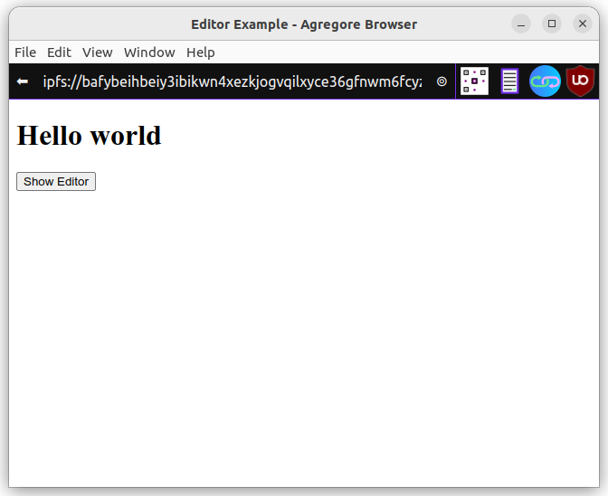
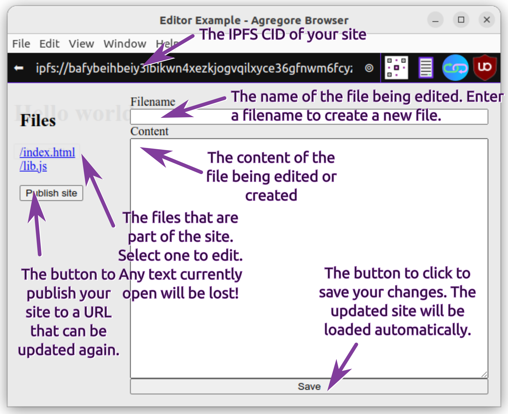
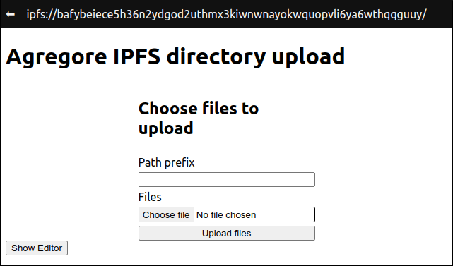

In this tutorial we will create an app that allows you to upload a whole directory of files to IPFS! The plan is to use this functionality in a future tutorial to add support for uploading 3rd-party dependencies, but you can use it for other purposes like uploading media to a site you want to build!

## Getting started!

We will be using a [self-hosted development environment](/docs/examples/browser-devenv/) for Agregore that we created in a [previous tutorial](/docs/tutorials/ipfs-browser-devenv/part-1). 

To complete this tutorial, you will need to download and the latest version of the [Agregore Browser](https://github.com/AgregoreWeb/agregore-browser).

Open up the [development environment](/docs/examples/browser-devenv/) in the Agregore Browser and click on "Start". This will copy the development environment for you to start working on your own IPFS hosted site. Once the site successfully loaded, you should see:




Click on the "Show Editor" button to open the development environment. Here is a quick overview:




## Let's upload some files

The simplest way to upload a directory of files is using [`<input type="file" webkitdirectory />`](https://developer.mozilla.org/en-US/docs/Web/API/HTMLInputElement/webkitdirectory). This will change the behavior of a normal file input to select a whole directory. The browser will recursively traverse the chosen directory and add all the files to the [`.files`](https://developer.mozilla.org/en-US/docs/Web/API/FileList) attribute of the input component. While `webkitdirectory` isn't accepted as part of the standard yet, it is implemented by many popular browsers.

Let's start by updating `index.html`. We will add a form with two inputs. The first input is just a text input to allow us to optionally specify a prefix for uploading the directory if needed. The second input is for selecting the directory we want to upload. We will also include links to a stylesheet and JavaScript file that we'll be adding shorty. Open `index.html` in the editor and replace the contents with the following:

```html
<!DOCTYPE html>
<html lang="en">
  <link rel="stylesheet" href="style.css">
  <title>Agregore IPFS directory upload</title>
  <h1>Agregore IPFS directory upload</h1>
  <form id="dirForm">
    <h2>Choose files to upload</h2>
    <label for="idPathPrefixInput">Path prefix</label>
    <input id="idPathPrefixInput" type="text" name="pathPrefix" />
    <label for="idFileInput">Files</label>
    <div class="fileInputWrapper">
      <input id="idFileInput" type="file" name="dir" webkitdirectory />
    </div>
    <button type="submit">Upload files</button>
  </form>
  <button onclick="window.showEditor()">Show Editor</button>
  <script src="lib.js"></script>
  <script src="upload.js"></script>
</html>
```

Next we will create the stylesheet we've referenced above. Open the editor, but instead of selecting a file, type `style.css` in the filename field and add the following CSS to the 'Content' field:

```css
@import url("agregore://theme/vars.css");
html {
    font-family: var(--ag-theme-font-family);
}

#dirForm {
    display: flex;
    flex-direction: column;
    gap: 5px;
    width: 40%;
    margin: auto;
}

input[type=file]::file-selector-button {
    border: none;
    padding: .2em .4em;
}

.fileInputWrapper {
    border: 1px solid black;
    border-radius: 3px;
}
```

You should see a page that looks like this:



To upload the directory, we need to handle the form submission event. In the handler we will iterate through the files and upload them to IPFS using fetch. This is possible because AgregoreWeb implements a special set of protocol handlers that integrates with IPFS.

Create a new file called `upload.js` and add the following content:

```js
async function onSubmit(e) {
    console.log('📥 📥 📥')
    e.preventDefault()

    let currentCid = window.origin

    // get the prefix and clean it up a bit
    let pathPrefix = document.querySelector('#idPathPrefixInput').value
    while (pathPrefix.startsWith('/')){
        pathPrefix = pathPrefix.slice(1)
    }
    while (pathPrefix.endsWith('/')){
        pathPrefix = pathPrefix.slice(0, -1)
    }

    const fileInput = document.querySelector('#dirForm input[type="file"]')
    for (const file of fileInput.files){
        console.log(file.webkitRelativePath)
        let filePath = file.webkitRelativePath
        if (pathPrefix) {
            filePath = `${pathPrefix}/${filePath}`
        }
        const resp = await fetch(`${currentCid}/${filePath}`, {method: 'put', body: file})
        currentCid = new URL(resp.headers.get('location')).origin
        const folderName = file.webkitRelativePath.split('/')[0]
        console.log(currentCid + (pathPrefix && '/') + pathPrefix + '/' + folderName)
    }
}

window.addEventListener('load', e => {
    const form = document.querySelector('#dirForm')
    form.addEventListener('submit', onSubmit)
})
```

We can now go ahead and test the code. To see what is happening, we first need to open the developer tools - you can do so by pressing Ctrl+Shift+I or using the 'File' menu - and select the "consoler" tab. Now choose a folder using the file input or drag and drop a folder onto it and press "Upload files". After each file that has been uploaded, you should see a URL logged to the console. You can open some of these URLs to see what they contain.

## Make it go faster!

Notice that we are sequentially uploading the files. Each time we upload a file, we get back a new CID. This CID references an IPFS directory that contains all the files uploaded up to that point. We then upload the next file to that IPFS directory, create a new IPFS that contains the new file. We do this until we've uploaded all the files.

This isn't the most efficient way to upload multiple files. In agregore we can upload multiple files at the same time using FormData.

```js
let formData = new FormData()
for (const file of files){
   formData.append('file', file) 
}
const resp = await fetch(window.origin, {method: 'put', body: formData})
```

Unfortunately we can't upload files to different directories at the same time. This means that we need to find all the files that are in the same directory and upload them together. Let's look at an example directory structure:

**Update 2024-01-29**: since Agregore v2.4.0 the issue has been resolved and files in different folders can now be uploaded together. For the sanity of the writer, and the learning value of the thought process of implementing the solution, the code below is updated to still work in v2.4.0, but not entirely reworked. A more sensible approach would be to create batches of a fixed size to upload files together.

```
- animals
    - dogs
        - pug.png
        - hound.png
    - cats
        - ginger.png
        - black.png
    - giraffe.png
```

In this example `input.files` [FileList](https://developer.mozilla.org/en-US/docs/Web/API/FileList) would contain the following files if we select the directory:

```
/animals/dogs/pug.png
/animals/dogs/hound.png
/animals/cats/ginger.png
/animals/cats/black.png
/animals/giraffe.png
```

And we want to upload them in 3 batches. Batch one would be 

```
/animals/dogs/pug.png
/animals/dogs/hound.png
```

Batch 2:
```
/animals/cats/ginger.png
/animals/cats/black.png
```

And batch 3:
```
/animals/giraffe.png
```

Here is pseudo code for the algorithm we'll implement to achieve this:

```
while the array has elements in it
    take the last element in the array
    extract the path component of that element
    for every element remaining in the array, 
       extract the path component
       if the path component matches, 
           add the element to a list for the files to be uploaded together
           remove the element from the array
    upload all the files in the batch
```

And here is the algorithm translated to JavaScript code. Add it to `upload.js`:

```js
async function batchUpload(fileList, pathPrefix){
    let currentCid = window.origin
    let files = Array.from(fileList)
    while (files.length > 0){
        let batch = [files.pop()]
        batchPath = batch[0].webkitRelativePath.split('/').slice(0,-1).join('/')
        console.log('Looking for files with matching path', batchPath)
        for (var i=files.length-1; i>=0; i--){
            if(batchPath == files[i].webkitRelativePath.split('/').slice(0,-1).join('/')){
                batch.push(files[i])
                files[i] = files[files.length-1] // copy last element over matched file
                files.pop() // remove last element
            }
        }

        console.log(batch)
        let formData = new FormData()
        for (const file of batch){
           formData.append('file', file) 
        }
        // let putUrl = [currentCid, pathPrefix, batchPath].join('/') // <-- uncomment this line if you are using Agregore < 2.4.0
        let putUrl = [currentCid, pathPrefix].join('/') // <-- delete this line if using Agregore < 2.4.0
        const resp = await fetch(putUrl, {method: 'put', body: formData})
        currentCid = new URL(resp.headers.get('location')).origin
        console.log(currentCid + (pathPrefix && '/') + pathPrefix)
        console.log(`Uploaded ${fileList.length-files.length}/${fileList.length} files`)
    }
    return currentCid
}
```

Let's replace the previous upload code in `onSubmit` by calling the function we created above:

```diff
-   for (const file of fileInput.files){
-       console.log(file.webkitRelativePath)
-       let filePath = file.webkitRelativePath
-       if (pathPrefix) {
-           filePath = `${pathPrefix}/${filePath}`
-       }
-       const resp = await fetch(`${currentCid}/${filePath}`, {method: 'put', body: file})
-       currentCid = new URL(resp.headers.get('location')).origin
-       const folderName = file.webkitRelativePath.split('/')[0]
-       console.log(currentCid + (pathPrefix && '/') + pathPrefix + '/' + folderName)
-   }
+   const newCid = await batchUpload(fileInput.files, pathPrefix)
```

Try uploading the same directory again. In the development console you should be seeing that files are uploaded in one or more batches depending on the hierarchy of the directory you've chosen.

Unfortunately we can't further optimize this by doing the uploads in parallel since each upload relies on the returned CID from the previous operation to end up in the same place.

## Clean it up!

We want to integrate this directory upload functionality with our development environment we've been using thus far. But before we do so, we want to make it easier to use it. We will do this by creating a [Web Component](https://developer.mozilla.org/en-US/docs/Web/API/Web_components) that will contain the interface and logic for this element.

Let's move the HTML, the code for the submit handler (`onSubmit`) and the document load event handler code into the web component. We also in-lining the CSS to make it a bit easier:

```js
class DirectoryUpload extends HTMLElement {
    constructor () {
        super()
    }

    connectedCallback () {
        this.innerHTML = `<form id="dirForm">
            <h2>Choose files to upload</h2>
            <label for="idPathPrefixInput">Path prefix</label>
            <input id="idPathPrefixInput" type="text" name="pathPrefix" />
            <label for="idFileInput">Files</label>
            <div class="fileInputWrapper">
              <input id="idFileInput" type="file" name="dir" webkitdirectory />
            </div>
            <button type="submit">Upload files</button>
        </form>
        <style>
            #dirForm {
                display: flex;
                flex-direction: column;
                gap: 5px;
            }
            input[type=file]::file-selector-button {
                border: none;
                padding: .2em .4em;
            }
            .fileInputWrapper {
                border: 1px solid black;
                border-radius: 3px;
            }
        </style>`
        const form = this.querySelector('#dirForm')
        form.addEventListener('submit', this.onSubmit)
    }

    async onSubmit(e) {
        console.log('📥 📥 📥')
        e.preventDefault()

        let currentCid = window.origin

        // get the prefix and clean it up a bit
        let pathPrefix = document.querySelector('#idPathPrefixInput').value
        while (pathPrefix.startsWith('/')){
            pathPrefix = pathPrefix.slice(1)
        }
        while (pathPrefix.endsWith('/')){
            pathPrefix = pathPrefix.slice(0, -1)
        }
    
        const fileInput = document.querySelector('#dirForm input[type="file"]')
        const newCid = await batchUpload(fileInput.files, pathPrefix)
    }
}

customElements.define('directory-upload', DirectoryUpload);
```

Next we can update `index.html` and replace the form with the custom element:

```diff
<!DOCTYPE html>
<html lang="en">
  <link rel="stylesheet" href="style.css">
  <title>Agregore IPFS directory upload</title>
  <h1>Agregore IPFS directory upload</h1>
- <form id="dirForm">
-   <h2>Choose files to upload</h2>
-   <label for="idPathPrefixInput">Path prefix</label>
-   <input id="idPathPrefixInput" type="text" name="pathPrefix" />
-   <label for="idFileInput">Files</label>
-   <div class="fileInputWrapper">
-     <input id="idFileInput" type="file" name="dir" webkitdirectory />
-   </div>
-   <button type="submit">Upload files</button>
- </form>
+ <directory-upload></directory-upload>
  <button onclick="window.showEditor()">Show Editor</button>
  <script src="lib.js"></script>
  <script src="upload.js"></script>
</html>
```

And let's remove the CSS we moved from `style.css`:

```diff
@import url("agregore://theme/vars.css");
html {
    font-family: var(--ag-theme-font-family);
}
-
-#dirForm {
-    display: flex;
-    flex-direction: column;
-    gap: 5px;
-    width: 40%;
-    margin: auto;
-}
-
-input[type=file]::file-selector-button {
-    border: none;
-    padding: .2em .4em;
-}
-
-.fileInputWrapper {
-    border: 1px solid black;
-    border-radius: 3px;
-}
```

Everything should still work as before if you test it now.

## Integrate it into our devenv

We are almost ready to add this to our development environment! Up until now we've printed the address for the uploaded files to the console, but if we want to use the component, we need a better way to know when it's completed and take some action. 

We will do this using a [custom event](https://developer.mozilla.org/en-US/docs/Web/Events/Creating_and_triggering_events) and passing the new CID along with the event. Add the following line of code of `onSubmit` in `upload.js`:

```diff
const newCid = await batchUpload(fileInput.files, pathPrefix)
+this.dispatchEvent(new CustomEvent('dirUpload', { detail: { cid: newCid } }))
```

To use this, we can handle the 'dirUpload' event. So let's add the component to our devenv and handle the event. Add the following code to the end of the `loadSidebar` function in `lib.js`:

```js
    let dirUploadForm = document.createElement('directory-upload')
    dirUploadForm.addEventListener('dirUpload', e => {
        console.log('onDirUpload', e)
        window.location = e.detail.cid
    })
    sidebar.appendChild(dirUploadForm)
```

We need to fix an issue that didn't cause problems before. The event handler that handles the form submission is emitting the event on the form, rather than the component. To fix this, we need to bind the event handler to the custom component we've created by changing this line of `connectedCallback` in `upload.js`:

```diff
-form.addEventListener('submit', this.onSubmit)
+form.addEventListener('submit', this.onSubmit.bind(this))
```

And finally we can remove the upload from from `index.html`:

```diff
<!DOCTYPE html>
<html lang="en">
  <link rel="stylesheet" href="style.css">
  <title>Agregore IPFS directory upload</title>
  <h1>Agregore IPFS directory upload</h1>
- <directory-upload></directory-upload>
  <button onclick="window.showEditor()">Show Editor</button>
  <script src="lib.js"></script>
  <script src="upload.js"></script>
</html>
```

Now when we upload files, it will add the files to our site and take us to the new site so we can carry on working on it!

When you upload a bunch of files, you might notice that this creates some issues with the layout of the sidebar and editor. For now we'll fix that by tweaking the hard-coded style in `lib.js` as follows:
```
    editorDiv.innerHTML = `<div style="display: flex; flex-grow: 1; padding: 1em">
-       <div id="idSidebar" style="padding-right: 1em; min-width: 20vw;"><h2>Files</h2>
+       <div id="idSidebar" style="padding-right: 1em; width: 20vw; overflow:scroll;"><h2>Files</h2>
        </div>
        <form id="idForm" style="flex-grow: 1; display: flex; flex-direction: column;" spellcheck="false">
            <label for="idFilenameInput">Filename</label>
            <input type="text" name="filename" id="idFilenameInput"></input>
            <label for="idContentInput">Content</label>
            <textarea id="idContentInput" style="flex-grow: 1;" rows="20"></textarea>
            <input type="submit" value="Save"></input>
        </form>
    </div>`
```

## Show the user what is happening

Now that everything is working, let's add a modal indicate that the files are being uploaded. We will use another custom event to indicate when an upload starts. Add the following to the `onSubmit` handler in `upload.js` after assigning the `fileInput` variable and before calling `batchUpload`:

```js
         const fileInput = document.querySelector('#dirForm input[type="file"]')
         this.dispatchEvent(new CustomEvent('dirUploadStart', { detail: { fileCount: fileInput.files.length } }))        // <--- Add this line
         const newCid = await batchUpload(fileInput.files, pathPrefix)

```

In `lib.js`, we will handle this new event and display a modal when the upload starts. When the upload completed, we will show a success message and redirect the page after a delay of 5 seconds. Update the code at the end of `loadSidebar` as follows:

```js
    dirUploadForm.addEventListener('dirUploadStart', e => {
        const modalDiv = document.createElement('div')
        modalDiv.id = 'uploadStatus'
        modalDiv.classList.add('modal')
        modalDiv.style = `display: flex; align-items: center; justify-content: center;`
        modalDiv.innerHTML = `<p>Uploading ${e.detail.fileCount} file(s)</p>`
        document.body.appendChild(modalDiv)
    })

    dirUploadForm.addEventListener('dirUpload', e => {
        console.log('onDirUpload', e)
        let modalDiv = document.getElementById('uploadStatus')
        modalDiv.innerHTML = `<p>Upload complete. You will be redirected shortly</p>`
        setTimeout(te => window.location = e.detail.cid, 5000)
    })
```

Finally we should add the CSS for the `modal` class. Add the following to the end of `style.css`:

```css
.modal {
    position: absolute;
    top: 0;
    left: 0;
    width: 100vw;
    height: 100vh;
    background-color: rgb(233 233 233 / 95%);
}
```

The final code can be found on [GitHub](https://github.com/AgregoreWeb/website/tree/main/docs/examples/browser-devenv-v2/files/). There is also an updated [self-hosted development environment](/docs/examples/browser-devenv-v2/) you can use!
