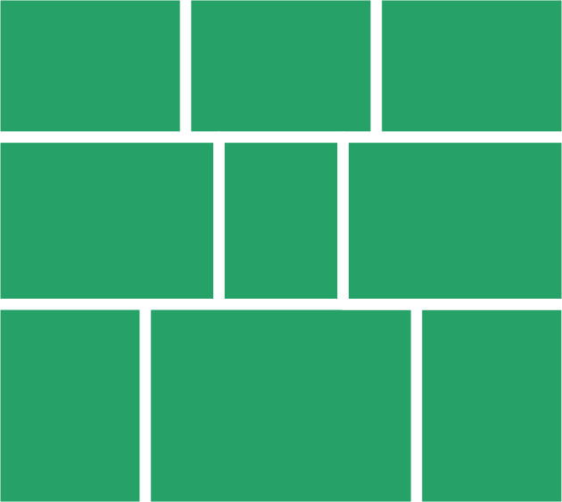

In this tutorial we will create an app to create and share an image gallery using IPFS.

To complete the tutorial, you will need the [Agregore Web](https://agregore.mauve.moe/) browser. Agregore supports several distributed protocols like IPFS and allows you to view and create the distributed web! You can find the latest version [here](https://github.com/AgregoreWeb/agregore-browser/releases/latest).

We will be using an Integrated Development Environment developed in a previous tutorial to write the code for this tutorial. This allows you to create and update your site with nothing other than the Agregore Web browser!

# Requirements

We want to create an image sharing app where a user can add their own images, create a gallery with those images and share them with another user.

The final application should be usable by anyone using Agregore Web and not require any deep technical knowledge.

# Get started

To get started, go to [this page](https://agregore.mauve.moe/docs/examples/browser-devenv-v3/) and click on **Start**. This will create a copy of the IDE for you to use during this tutorial.

# Image layout

We should decide how we want to layout our images. For inspiration we can look at how other popular photo sharing websites layout their images. I personally like the way that Flickr handles the layout. This image show the layout we are aiming for:



For a start, we will use some placeholder images from [picsum.photos](picsum.photos). By specifying the dimensions in the URL, we get a stock image of the desired size.

To create this layout, we will be using a flexbox layout. The gallery will consist of one or more rows where the height of each photo in the row is equal and the overall perspective of the row is adjusted to fit the row within the width of the screen. Add the following to 'index.html':

```html
<!DOCTYPE html>
<html lang="en">
  <title>Image gallery</title>
  
  <style>
      .gallery {
        display: flex;
        flex-wrap: wrap;
      }
      .gallery > .row {
        display: flex;
        width: 100%;
      }
      .gallery > .row img {
        height: 100%;
        width: auto;
        display: block;
      }
  </style>
  
  <div class="gallery">
      <div class="row">
        <div></div>
        <div></div>
        <div></div>
      </div>
      <div class="row">
        <div></div>
        <div></div>
        <div></div>
      </div>
      <div class="row">
        <div></div>
      </div>
  </div>
  
  <script src="lib.js"></script>
</html>
```

This gives us the basic layout, but the width of the rows aren't matched to the width of the page. Unfortunately getting the rows to match width with CSS isn't possibly (or at least now something I managed to do, so we'll need to use some JavaScript to do it for us.

What we want to do, is calculate the desired aspect ratio for a row by taking the height of the first image, scaling all the images to the same height and then calculating the width.

Create a new file by opening the editor and typing 'gallery.js' in the 'filename' field. Then add the following code:

```js
function layout(){
    const gallery = document.querySelector('.gallery')
    for (const row of gallery.querySelectorAll('.row')){
        let images = Array.from(row.querySelectorAll('img'))
        if (images.length > 0)
        {
            const ratioHeight = images[0].naturalHeight
            let ratioWidth = images[0].naturalWidth
            images.shift()
            while (images.length > 0){
                let image = images.shift()
                ratioWidth += image.naturalWidth*ratioHeight/image.naturalHeight
            }
            console.log(`aspect-ratio: ${ratioWidth}/${ratioHeight};`)
            row.style = `aspect-ratio: ${ratioWidth}/${ratioHeight};`
        }
    }
}

window.addEventListener('load', e => {
    layout()
})
```

And to use this code, we need to add it to `index.html`:

```html
<script src="gallery.js"></script>
```

Once a page loads, you should see the rows being adjusted to fill the width of the screen. What is happening is that by specifying the `aspect-ratio` for each row, we're changing the height, since the rows are already specified to be 100% width.

To make this a little nicer, change the CSS for `.gallery > .row` in the style element in 'index.html' to:

```css
      .gallery > .row {
        display: flex;
        width: 100%;
        aspect-ratio: 3;
        transition-property: aspect-ratio;
        transition-duration: 1.5s;
        overflow: hidden;
      }
```

This uses a [CSS transition](https://developer.mozilla.org/en-US/docs/Web/CSS/CSS_transitions) on `aspect-ratio` to animate the change. We also need to specify an initial `aspect-ratio: 3` for the transition to work and to stop the scroll bars from appearing and disappearing, we add `overflow: hidden`.

Let's update the HTML to use more realistically sized images:

```html
  <div class="gallery">
      <div class="row">
        <div></div>
        <div></div>
        <div></div>
        <div></div>
      </div>
      <div class="row">  
        <div></div>
        <div></div>
        <div></div>
        <div></div>
      </div>
      <div class="row">
        <div></div>
        <div></div>
        <div></div>
      </div>
      <div class="row">
        <div></div>
      </div>
  </div>
```

Notice how things still jump around while loading? We can fix this by specifying the width and the height in the `` elements:

```html
  <div class="gallery">
      <div class="row">
        <div></div>
        <div></div>
        <div></div>
        <div></div>
      </div>
      <div class="row">  
        <div></div>
        <div></div>
        <div></div>
        <div></div>
      </div>
      <div class="row">
        <div></div>
        <div></div>
        <div></div>
      </div>
      <div class="row">
        <div></div>
      </div>
  </div>
```

To make the layout work on mobile, we will use a [CSS media query](https://developer.mozilla.org/en-US/docs/Web/CSS/CSS_media_queries/Using_media_queries) that will change the layout so that images are each the full with of the screen rather than forming a complex grid. By adding

```css
      @media (width < 678px) {
          .gallery > .row {
              aspect-ratio: unset !important;
              flex-direction: column;
          }
          .gallery .row img {
              height: auto;
              width: 100%;
          }
      }
```

And let's get rid of the bit of margin around the edge, add the following CSS rule in the style element:

```css
    body { 
        margin: 0; 
    }
```

The last thing we'll add to the gallery is the ability to view individual images. Add a new child element to the gallery div:

```html
<div class="lightBox hidden"></div>
```

And then let's update the styling for this to display as an overlay. We will use absolute positioning to make it cover the whole screen

```css
      .hidden {
          display: none !important;
      }
      .lightBox {
        display: flex;
        justify-content: center;
        position: fixed;
        height: 100vh;
        width: 100%;
        backdrop-filter: blur(10px);
      }
      .lightBox > img {
        object-fit: contain;
        max-width: 100%;
        max-height: 100%;
      }
```

And then to show/hide the lightbox, we add a click event handler in 'gallery.js' to each image. We display the lightbox by removing the `hidden` class from the element and we update the image in the lightbox to be the one the user clicked on. **Note** if you are using the developer tools and caching is disabled, you will see a different image that the one you've clicked on.

```js
window.addEventListener('load', e => {
    layout()
    
    for (const img of document.querySelectorAll('.gallery .row img')){
        img.addEventListener('click', e => {
            document.querySelector('.lightBox img').src = img.src
            document.querySelector('.lightBox').classList.remove('hidden')
        })
    }
    
    document.querySelector('.lightBox img').addEventListener('click', e => 
        document.querySelector('.lightBox').classList.add('hidden')
    )
})
```

**A note about CSS classes** In most of this tutorial we specify the element `class` property rather than the `id` property, unless there REALLY should only be one element on the page (like a form input). We also prefer more specific CSS selectors rather than shorter ones that will probably also work in this app. This allows us to not worry too much about having style collisions while we're developing the app or if we develop it further at a later stage.

# Adding images to the gallery

Now that we can display a gallery with stock images, we want to work on adding our own. To make it easy for a user to build a gallery, we want to allow adding multiple images. 

Let's start by adding support for dragging and dropping one or more images onto the page. Add the following code to `gallery.js`:

```js
function dropListener(e){
    e.preventDefault()
    const { dataTransfer } = e
    if(!dataTransfer) return
    const files = Array.from(dataTransfer.files)
    console.log(files)
    for (const file of files){
        if (file.type.match(/image.*/)) {
            //TODO do something with the file
        }
    }
}
```

And register the event handlers

```js
    document.querySelector(".gallery").addEventListener("dragover", e => e.preventDefault())
    document.querySelector(".gallery").addEventListener("drop", dropListener)
```

To add an image to the gallery, we need to do the following
- create the markup required by the gallery, 
- get the image dimensions
- add an event handler for viewing the image
- find the right place in the gallery to add it to
- update the aspect ratio for the row the image was added to

To find the right place in the gallery, we use a CSS selector to get the last row of the gallery. If this row doesn't already have 3 images, we add the image here. If it already has 3 images, we create a new row, add the image and add the row to the gallery. Add this code in `gallery.js`:

```js
async function addFileToGallery(file){
    const columns = 3

    // Create markup
    const img = document.createElement("img")
    img.classList.add('new')
    img.dataset.fileName = file.name
    img.src = URL.createObjectURL(file);
    let imgDiv = document.createElement('div')
    imgDiv.appendChild(img)

    // Get dimensions
    const image = await createImageBitmap(file)
    img.width = image.width
    img.height = image.height

    // Add event listener for lightbox
    img.addEventListener('click', e => {
        document.querySelector('.lightBox img').src = img.src
        document.querySelector('.lightBox').classList.remove('hidden')
    })

    // Find the right place to add the image
    const gallery = document.querySelector('.gallery')
    if (gallery.querySelectorAll('.row:last-child img').length < columns){
        gallery.querySelector('.row:last-child').appendChild(imgDiv)
    } else {
        const div = document.createElement('div')
        div.classList.add('row')
        div.appendChild(imgDiv)
        gallery.appendChild(div)
    }

    // Call layout to recalculate the aspect ratios
    setTimeout(layout, 500)
}
```

Update the for loop in the `dropListener` function to add the images one by one:

```js
    for (const file of files){
        if (file.type.match(/image.*/)) {
            addFileToGallery(file).catch(console.log)
        }
    }
```

We could do things more efficiently, but by handling images one by one we can use our existing layout code!

Now we can add our own images to the gallery, but they are added after all the stock images. Let's remove all the stock images when we upload our own images. To do so, we're going to add a CSS class called stock to the markup for all the rows of stock images:

```html
      <div class="row stock">
        <div></div>
        <div></div>
        <div></div>
        <div></div>
      </div>
      <div class="row stock">  
        <div></div>
        <div></div>
        <div></div>
        <div></div>
      </div>
      <div class="row stock">
        <div></div>
        <div></div>
        <div></div>
      </div>
      <div class="row stock">
        <div></div>
      </div>
```

And then in `addFileToGallery` we want to remove any stock images when we add a new file. Notice that we move the declaration for `const gallery`.

```js
    // Remove stock images
    const gallery = document.querySelector('.gallery')                                                
    if (gallery.querySelectorAll('.row.stock').length > 0){
        for (const stockRow of gallery.querySelectorAll('.row.stock')){
            gallery.removeChild(stockRow)
        }
        const div = document.createElement('div')
        div.classList.add('row')
        gallery.appendChild(div)
    }
    
    // Find the right place to add the image
    if (gallery.querySelectorAll('.row:last-child img').length < columns){ 
```

We should indicate to a user that they can drag-and-drop images to add them to the gallery. Let's do this by adding an overlay over the gallery with stock images with some help text. We also want to allow the user to interact with the gallery with the stock images, so we will add the ability to minimize the overlay. Add the following to `index.html`:

```html
      <div class="helpOverlay">
        <p>Drag and drop images to begin.<span> Click anywhere to view the gallery.</span></p>
      </div>
```

And add the CSS for the overlay to the `<style>` tag:

```css
      .gallery > div.helpOverlay {
        display: flex;
        flex-direction: column;
        position: fixed;
        width: 100%;
        height: 100vh;
        background: rgba(0,0,0, 0.6);
        color: white;
        align-items: center;
        justify-content: center;
        padding: 0 5px;
      }
      .gallery > div.helpOverlay.small {
        height: unset;
        bottom: 0;
        padding-bottom: 15px;
      }
      .gallery > div.helpOverlay.small span {
          display: none;
      }
```

And to allow the user to minimize the help overlay, add a click handler in the `window.onload` event listener in 'gallery.js':

```js
  document.querySelector(".helpOverlay").addEventListener('click', e => {
      document.querySelector('.helpOverlay').classList.add('small')
  })
```

Drag-and-drop will only work on a desktop, to support a mobile device, we should add a file selector. We will use the [`showOpenFilePicker`](https://developer.mozilla.org/en-US/docs/Web/API/window/showOpenFilePicker) API for this. Let's update the help overlay to include a button that will open the file picker:

```html
      <div class="helpOverlay">
        <p>Drag and drop images to begin or <button>select files</button>.<span> Click anywhere to view the gallery.</span></p>
      </div>
```

Add the following function to 'gallery.js' to show the file picker and handle selected files:

```js
async function handleHelpClick(e){
    e.stopPropagation()
    const opts = {
        types: [
            {
                description: "Images",
                accept: {
                    "image/*": [".png", ".gif", ".jpeg", ".jpg"],
                },
            },
        ],
        excludeAcceptAllOption: true,
        multiple: true,
        startIn: "pictures",
    }
    let result = await showOpenFilePicker(opts)
    document.querySelector('.helpOverlay').classList.add('small')
    for (const fileHandle of result){
        let file = await fileHandle.getFile()
        await addFileToGallery(file)
    }
}
```

And bind it to the button on the help overlay by adding an event listener in 

```js
  document.querySelector(".helpOverlay button").addEventListener("click", handleHelpClick)
```

# Saving and sharing our gallery

To save our gallery and images, we will need to do two things. First we need to get all the files to upload and secondly we need to save the updated markup with the new images included.

To get all the images we need to upload, we must update the `addImage` method to store a list of files. We will do this by creating an array property attached to the window object where we will store a list of files that's been added:

```js
async function addFileToGallery(file){
    window.newImages = window.newImages || []                               //+
    window.newImages.push(file)                                             //+
    const columns = 3
    
    // Create markup 
```

We can use this array to get the files we need to upload. To update the markup, we will use the [DOMParser](https://developer.mozilla.org/en-US/docs/Web/API/DOMParser) API to load the original HTML document and add our updates. Add the following function to `gallery.js`:

```js
async function saveGallery(e){
    e.preventDefault()
    let formData = new FormData()

    // Add new images to formData
    for (const image of window.newImages){
        formData.append('file', image)
    }
    
    // Get the original HTML
    const index = await fetch('index.html')
    const txt = await index.text()
    const parser = new DOMParser()
    let newDoc = parser.parseFromString(txt, 'text/html')

    // Replace the gallery with the updated markup
    newDoc.querySelector('.gallery').replaceWith(document.querySelector('.gallery').cloneNode(true))
    for (const imgEl of newDoc.querySelectorAll('.gallery img.new')){
        imgEl.src = imgEl.dataset.fileName
        delete imgEl.dataset.fileName
        imgEl.classList.remove('new')
    }
    formData.append('file', new File([newDoc.documentElement.innerHTML], 'index.html'))
    
    // Post the new data to save the images and the gallery
    const resp = await fetch(window.origin, {method: 'put', body: formData})
    newCid = new URL(resp.headers.get('location')).origin
    console.log(`Uploaded ${newImages.length} files to ${newCid}`)
}
```

The data is saved to a new IPFS folder using the IPFS gateway implemented by Agregore Web.

Next we should connect the save functionality to the user interface. When a user changed the gallery, we want them to be able to save it. And once it's been saved, we want to show the link to the updated gallery. Add the following markup to the help overlay in 'index.html':

```html
    <div class="gallery">
        <div class="helpOverlay">
          <p>Drag and drop images to begin or <button>select files</button>.<span> Click anywhere to view the gallery.</span></p>
          <form id="idSaveGalleryForm" class="hidden">
              <p><button type="submit" value="submit">Save</button></p>
          </form>
          <p id="idGalleryUrl" class="hidden">
              <a href="/">View your gallery</a>
          </p>
        </div>
```

Add the following CSS to the style element in 'index.html':

```
      #idGalleryUrl a {
        color: white;
        font-weight: bold;
      }
```

Then we add the event listener for the form to 'gallery.js':

```js
    document.getElementById("idSaveGalleryForm").addEventListener("submit", saveGallery)
```

We should also remove the `hidden` class from the form when the gallery changes. Update the start of `addFileToGallery` in 'gallery.js' to 

```js
async function addFileToGallery(file){
    document.getElementById("idSaveGalleryForm").classList.remove('hidden')
```

And hide it again when we save the gallery. Update the start of `saveGallery` in 'gallery.js' as follows:

```js
async function saveGallery(e){
    e.preventDefault()
    // Hide save form and link before saving updated markup
    document.getElementById("idSaveGalleryForm").classList.add('hidden')
    document.getElementById("idGalleryUrl").classList.add('hidden')
```

And finally we should display the link for the gallery. Add the following to the end of `saveGallery` in 'gallery.js':

```js
    document.querySelector("#idGalleryUrl").classList.remove('hidden')
    document.querySelector("#idGalleryUrl a").href = newCid
```

# Downloading stock images

Up until now, we've relied on stock images that are being downloaded from the [Lorum Picsum](https://picsum.photos/) servers using HTTP. Since we want to distribute our application over IPFS, we should also host the stock images on IPFS. Luckily for us they use imagery from Unsplash, and the [license](https://unsplash.com/license) allows us to download and host the images. To do so add the following function to 'gallery.js':

```js
async function downloadStock(){
    // Initialize the newImages array
    window.newImages = window.newImages || []

    // Get all the stock images
    const imageNodes = document.querySelectorAll('.gallery .row.stock img')
    for (let i = 0; i < imageNodes.length; ++i){
        let img = imageNodes.item(i)
        // Download the image and update the src
        let response = await fetch(img.src)
        window.newImages.push(new File([await response.blob()], `/stock/image-${i}.jpg`))
        img.src = `/stock/image-${i}.jpg`
    }

    // Utilize saveGallery to upload the files and updated markup for us
    await saveGallery({preventDefault: () => true})
    console.log('Navigate to ', document.querySelector("#idGalleryUrl a").href)
}
```

To upload the stock images, we should manually trigger this function once. Open the developer console and execute `await downloadStock()`. Once the command finished, you'll see the new IPFS URL. Manually navigate to this URL and all your stock imagery will now be hosted with the gallery.

Your gallery app is now ready to be distributed over IPFS. You should be able to open up the current version of your gallery without being connected to the internet, add images and share it with someone else over IPFS!

# Hosting it on HTML

If you've followed this tutorial, you will have this code hosted on IPFS, but if you host the code on HTML, it won't work entirely as intended. We can at least make the gallery function by posting updates to an new IPFS directory when hosted over HTTP. In the `saveGallery` function in 'gallery.js', change the following code:

```js
    if (!window.origin.startsWith('ipfs://')){
        newDoc.querySelector('.gallery .helpOverlay').remove()
    }
    formData.append('file', new File([newDoc.documentElement.innerHTML], 'index.html'))

    let postUrl = window.origin
    if (!window.origin.startsWith('ipfs://')){
        postUrl = 'ipfs://bafyaabakaieac/'
    }

    // Post the new data to save the images and the gallery 
    const resp = await fetch(postUrl, {method: 'put', body: formData})
```

This will create a gallery with all the images and 'index.html', but 'gallery.js' and all the other files that are part of the editor will be missing. Since a user wouldn't be able to add more images to this gallery, we removed the help overlay to avoid confusion.

You can find the final code for [index.html](https://github.com/AgregoreWeb/website/blob/main/docs/examples/ipfs-gallery/index.html) and [gallery.js](https://github.com/AgregoreWeb/website/blob/main/docs/examples/ipfs-gallery/gallery.js) on GitHub. A live version of the application hosted over HTTP is available [here](/docs/examples/ipfs-gallery/).
