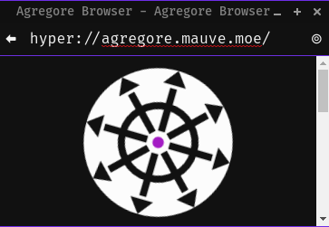

<style>
.agregore-logo {
  width: 50%;
  animation-name: pulse;
  animation-duration: 1.5s;
  animation-timing-function: linear;
  animation-direction: alternate;
  animation-iteration-count: infinite;
  animation-play-state: running;
}
@keyframes pulse {
  0% {
    transform: scale(1);
  }
  100% {
    transform: scale(1.05);
  }
}
</style>


# Agregore

Explore the distributed web

[Explore](./explore)
[Blog](./blog/)
[Protocols](./protocols)
[Docs](./docs/)
[Extensions](./extensions)
[Theming](./theming)
[Videos](./videos)
[Download](https://github.com/AgregoreWeb/agregore-browser/releases/latest)
[Mobile](https://github.com/AgregoreWeb/agregore-mobile/)

### Watch the 5 Minute Intro</h3>

<iframe width="560" height="315" src="https://archive.org/embed/dweb-meetup-dec-2020-dweb-lightning-talks?start=4212" title="Agregore 4 minute intro" frameborder="0" allow="accelerometer; autoplay; clipboard-write; encrypted-media; gyroscope; picture-in-picture" allowfullscreen></iframe>

### What is the distributed web?</h3>

The current web works by having companies set up servers which host people's websites and data.
This means that if a company goes down, or if a person doesn't have access to their server (say they're offline, behind a firewall, or can't afford a decent connection) they can't access it.
This also means that not everybody can publish things since it takes a lot of technical know-how to host things that they can have full control over.

The distributed web works by removing central web servers and instead using [Peer to Peer connections](https://en.wikipedia.org/wiki/Peer-to-peer) directly between people to load data.
If you want to create something, you serve it directly from your computer, and when somebody downloads their content they will also re-share it.
The more people load some data, the more resilient it is and the faster it can be downloaded.

As well, once you've loaded some data over the distributed web, you no longer need to be connected to the internet to access it.
In fact, if you have a bunch of people connected to a wifi router in the middle of nowhere, your peer to peer apps will all keep working.

### How does it work?

Agregore works by letting you load web pages and content from peer to peer protocols the same way you would load them from a website.



In the same way as you can navigate to `http://example.com`, you can navigate to `hyper://blog.mauve.moe` and have it load from anybody on the network that has a copy.
This can be done via the different protocols that Agregore supports like [BitTorrent](https://github.com/AgregoreWeb/agregore-markdown-site-generator), [IPFS](https://ipfs.io), and [Hypercore Protocol](https://github.com/AgregoreWeb/agregore-markdown-site-generator).
The web contents are rendered via Chromium using the [Electron framework](https://www.electronjs.org/).
Electron is useful since it's what allows us to publish Agregore on Windows, MacOS, and Linux.

### How do I share stuff?

Agregore not only supports loading data through custom protocols, but it also provides APIs for uploading data into peer to peer protocols.
This is done via the browser's [fetch()](https://developer.mozilla.org/en-US/docs/Web/API/WindowOrWorkerGlobalScope/fetch) API which is what web developers use to talk to web servers over HTTP or HTTPS.

You can create your own peer to peer website using this simple code snippet:

```javascript
// Upload your website page
await fetch("hyper://example/index.md", {
  method: "post",
  body: `
# Hello World!
`
})
// Navigate to the website
window.location.href = "hyper://example/"
```

For more details and demos, check out the the [Videos](videos.html) page, or read the [Fetch API Docs](https://github.com/AgregoreWeb/agregore-browser/tree/master/docs).

[Source Code](https://github.com/AgregoreWeb/agregore-browser)
[Contact](mailto:agregore@mauve.moe)
[Discord](https://discord.gg/QMthd4Y)
[Matrix](https://matrix.to/#/#agregore:mauve.moe)
[Mastodon](https://mastodon.mauve.moe/@agregore)
[Twitter](https://twitter.com/AgregoreBrowser)
